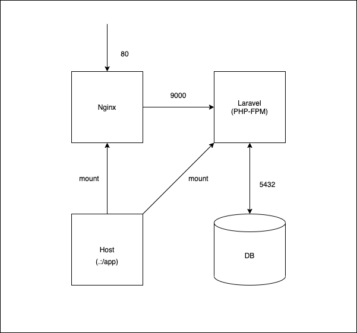

## 概要
Laravelの環境構築テンプレートです。
※1 バージョンを変えられるようにLaravelをインストールする前で止めています。
※2 LTSである6系で使うとよいと思います。

## DockerImageのバージョン等
- php:7.4-fpm-alpine
- nginx:1.19-alpine
- postgres:12

## 構成図


## 環境立ち上げ
```
$ docker-compose up
```

## Laravelのインストール
直下のディレクトリに作ろうとするとファイルが存在していて怒られるため、一度「blog」として作成します。
```
$ docker-compose exec app composer create-project --prefer-dist laravel/laravel blog "6.*"
```

blog内のファイルを直下にコピーします。
※Mac側でファイル操作をすると早く終わります。
```
$ docker-compose exec app cp -R ./blog/. ./
```

最後にblogを削除します。
```
$ docker-compose exec app rm -rf blog
```

「http://localhost」でWelcome画面が表示されれば成功です。